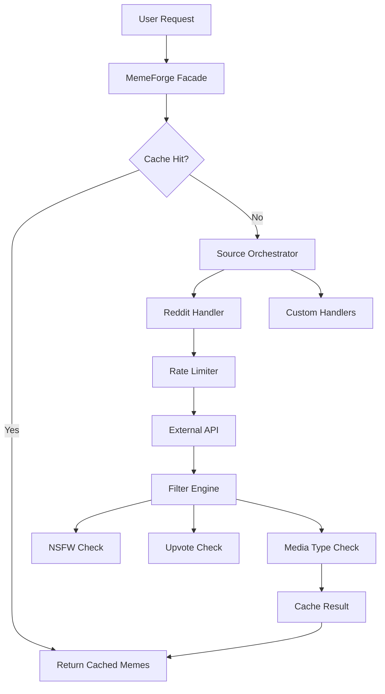

# MemeForge 🚀

**The high-performance, pluggable meme engine for Node.js.**  
*Optimized for Discord, built for speed, and designed for extensibility.*

[](https://www.npmjs.com/package/memeforge)
[](https://opensource.org/licenses/MIT)
[](https://www.typescriptlang.org/)

---

## 🧐 What is MemeForge?

MemeForge is not just another Reddit fetcher. It's a complete **meme orchestration engine**. Whether you're building a Discord bot, a social media automation tool, or just need a steady stream of dank memes, MemeForge provides a robust, type-safe, and cached API to get the job done.

## ✨ Core Features

- 🏎️ **Extreme Performance**: Built-in caching layer (TTL) and request throttling.
- 🔌 **Pluggable Architecture**: Easily add Reddit, Twitter, or your own custom API sources.
- 🛡️ **Smart Filters**: Advanced NSFW detection, upvote thresholds, and media type (GIF/Video/Image) filtering.
- 🤖 **Discord Native**: First-class support for Discord embeds with automatic truncation and formatting.
- 🧬 **Type Safety**: Written from the ground up in TypeScript for a superior DX.

---

## �️ Installation

```bash
npm install @imphoenix2k3/memeforge
```

## � Quick Start

### 1. Simple Fetch
Get raw meme data from top subreddits in one call.

```typescript
import { memeForge } from 'memeforge';

const memes = await memeForge.fetch({
  subreddits: ['memes', 'dankmemes'],
  limit: 5,
  minUpvotes: 1000
});
```

### 2. Discord Bot (discord.js)
The easiest way to send memes in Discord. Check out our [Full Discord Integration Guide](./docs/discord-bot-guide.md).

```typescript
const embed = await memeForge.fetchOne({
  format: 'discord-embed',
  subreddit: ['wholesomememes'],
  nsfw: false
});

await interaction.reply({ embeds: [embed] });
```

---

## 🎨 How it Works



---

## 📚 Documentation Index

Need detailed help? Check out our deep-dive guides:

- 🏗️ **[Architecture Overview](./docs/architecture.md)**: How the engine's layers (Facade, Orchestrator, Handler) interact.
- 🔌 **[Custom Sources Guide](./docs/custom-sources.md)**: A step-by-step guide on how to extend the engine.
- 🎮 **[Discord Bot Integration](./docs/discord-bot-guide.md)**: 5-minute setup for `discord.js` bots (ESM & CommonJS).

---

## ⚙️ Advanced Configuration

| Option | Type | Default | Description |
| --- | --- | --- | --- |
| `source` | `string` | `'reddit'` | The source engine to use. |
| `subreddits` | `string[]` | `['memes', ...]` | Subreddits for Reddit source. |
| `limit` | `number` | `1` | Number of memes to fetch. |
| `nsfw` | `boolean` | `true` | Include NSFW content? |
| `minUpvotes`| `number` | `0` | Minimum upvotes filter. |
| `mediaType` | `string` | `'any'` | `image`, `gif`, `video`, or `any`. |
| `format` | `string` | `'json'` | `json` or `discord-embed`. |
| `cache` | `boolean` | `true` | Enable/Disable in-memory cache. |

---

## 🆘 Support & Community

Running into issues? Don't worry, we've got your back!

- 🐛 **Found a bug?** Open an [Issue](https://github.com/PhoenixUchiha/Meme-Forge/issues).
- 💬 **Need help or want to chat?** [Join our Discord Server](https://discord.gg/your-invite-link).
- 🛠️ **Error in docs?** Pull requests are always welcome!

## 📜 License

MIT © [PhoenixUchiha](https://github.com/PhoenixUchiha/Meme-Forge)
